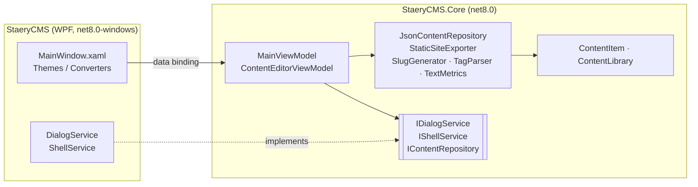

<div align="center">


# StaeryCMS

**A desktop content management system for writing in Markdown and publishing a static website.**

[](https://github.com/Staery/StaeryCMS/actions/workflows/ci.yml)


[](LICENSE)

**English** · [Русский](README.ru.md)

</div>

---

StaeryCMS is a Windows desktop app for managing articles, pages and notes. You write in Markdown, sort entries with
categories, tags and statuses, and export everything that is published as a ready-to-host static HTML site.

I built it to practise production-style WPF development: a clean MVVM architecture, testable business logic, safe
persistence and a hand-made UI theme.

## ✨ Features

| | |
|---|---|
| 📝 **Markdown editor** | Title, summary, body, category and tags, with a live word count and reading-time estimate |
| 🔗 **Smart slugs** | URL slugs follow the title automatically, transliterate Cyrillic (`Мой пост` → `moy-post`) and are checked for uniqueness |
| 🚦 **Content workflow** | **Draft → Published → Archived** statuses. The first publication date is recorded |
| 🔍 **Search & filters** | Full-text search across title, body and tags, plus filters by status and category and three sort orders |
| 🌐 **Static site export** | Builds `index.html`, one page per published entry and a responsive stylesheet. Raw HTML is escaped |
| 👁 **Browser preview** | Opens the current entry in your browser, including changes you haven't saved yet |
| 💾 **Safe storage** | Human-readable JSON with atomic writes. A damaged file is moved aside instead of being overwritten |
| 🛡 **No lost work** | Asks you to save, discard or cancel when you switch entries or close the app with unsaved changes |
| ⌨️ **Keyboard-first** | `Ctrl+N`, `Ctrl+S`, `Ctrl+P`, `Ctrl+F`, `Ctrl+Shift+E` |

<!-- Add a screenshot of the running app here, e.g. docs/screenshot.png -->

## 🧱 Tech stack

| Area | Technology |
|---|---|
| Runtime | .NET 8, C# 12 (nullable reference types, file-scoped namespaces, primary constructors) |
| UI | WPF, custom resource dictionaries (styles, templates, converters), Segoe Fluent Icons |
| Architecture | MVVM with [CommunityToolkit.Mvvm](https://learn.microsoft.com/dotnet/communitytoolkit/mvvm/) source generators |
| Markdown | [Markdig](https://github.com/xoofx/markdig) with advanced extensions (tables, task lists, …) |
| Storage | `System.Text.Json` |
| Tests | xUnit, 60+ tests: unit tests plus view-model scenarios with fakes |
| CI/CD | GitHub Actions: build, test and a self-contained single-file `.exe` on every push. Tagged versions are published as GitHub releases |

## 🏗 Architecture

The solution has two layers. All of the logic, including the view models, lives in a UI-independent class library,
so it is fully unit-tested and also builds on Linux and macOS. The WPF project contains only XAML, converters and
thin platform services.



Key design decisions:

- **Editor works on a copy.** `ContentEditorViewModel` edits a working copy, and `Commit()` writes it to the stored
  entry. This makes *Discard*, the unsaved-changes prompt and previews of unsaved text easy to implement.
- **Platform services behind interfaces.** Message boxes, the folder picker and opening the browser are hidden behind
  `IDialogService` and `IShellService`, so view-model tests run without a UI.
- **Time is injected** with `TimeProvider`, so timestamps can be tested deterministically.
- **Atomic persistence.** Data is written to a temporary file first and then swapped in, so a crash cannot truncate
  the library.

### Project layout

```
StaeryCMS/
├── src/
│   ├── StaeryCMS/                 # WPF application (views, theme, platform services)
│   │   ├── Themes/                # Colors.xaml, Controls.xaml: the design system
│   │   ├── Converters/
│   │   ├── Services/              # DialogService, ShellService
│   │   └── MainWindow.xaml
│   └── StaeryCMS.Core/            # UI-independent logic
│       ├── Models/                # ContentItem, ContentLibrary, ContentStatistics
│       ├── Services/              # Repository, exporter, slug/tag/text helpers
│       ├── ViewModels/            # MainViewModel, ContentEditorViewModel, …
│       └── Abstractions/          # IDialogService, IShellService
├── tests/
│   └── StaeryCMS.Core.Tests/      # xUnit tests
└── .github/workflows/ci.yml
```

## 🚀 Getting started

### Download

Download the latest `StaeryCMS-*-win-x64.zip` from [Releases](https://github.com/Staery/StaeryCMS/releases), or the
`StaeryCMS-win-x64` artifact of the latest [CI run](https://github.com/Staery/StaeryCMS/actions). It is a
self-contained `.exe`, so you don't need to install .NET.

### Build from source

Requirements: Windows 10/11 and the [.NET 8 SDK](https://dotnet.microsoft.com/download/dotnet/8.0) (or Visual Studio
2022 with the *.NET desktop development* workload).

```bash
git clone https://github.com/Staery/StaeryCMS.git
cd StaeryCMS
dotnet run --project src/StaeryCMS
```

Run the tests on any OS:

```bash
dotnet test tests/StaeryCMS.Core.Tests
```

Build a single-file executable:

```bash
dotnet publish src/StaeryCMS -c Release -r win-x64 --self-contained -p:PublishSingleFile=true -o publish
```

## 📖 Usage

1. On first launch, StaeryCMS creates a few sample entries so you can look around.
2. Press **New entry** (`Ctrl+N`), enter a title and write the body in Markdown.
3. Set the status to **Published** and press **Save** (`Ctrl+S`).
4. Enter the site title in the sidebar and click **Export static site** (`Ctrl+Shift+E`). The exported folder can be
   uploaded to GitHub Pages, Netlify or any web server.

| Shortcut | Action |
|---|---|
| `Ctrl+N` | New entry |
| `Ctrl+S` | Save |
| `Ctrl+P` | Preview in browser |
| `Ctrl+F` | Focus search |
| `Ctrl+Shift+E` | Export static site |

### Where is my data?

Everything is stored in a single JSON file at `%APPDATA%\StaeryCMS\content.json`. You can open it with
**Open data folder** in the sidebar.

```json
{
  "siteTitle": "My Staery Site",
  "items": [
    {
      "id": "0b9d4c1e-…",
      "title": "Welcome to StaeryCMS",
      "slug": "welcome-to-staerycms",
      "status": "published",
      "category": "Guides",
      "tags": ["getting-started"],
      "body": "# Welcome!\n…",
      "publishedAt": "2025-03-08T12:00:00+03:00"
    }
  ]
}
```

## 🧪 Tests

The tests in `tests/StaeryCMS.Core.Tests` cover:

- **Slug generation**: transliteration, accents, truncation, uniqueness and validation
- **Text helpers**: word counting (including Cyrillic) and tag parsing
- **Repository**: full round trip, readable JSON, tolerance of hand-edited files, backup of corrupt files
- **Exporter**: only published entries, ordering, HTML escaping, protection against path traversal through slugs
- **MainViewModel scenarios**: filters and sorting, create/save/delete/duplicate, the unsaved-changes prompt (save,
  discard, cancel), recovery when a save fails, export and closing the app

## 🗺 Roadmap

- [ ] Live Markdown preview pane (WebView2)
- [ ] Image library with drag & drop
- [ ] Scheduled publishing
- [ ] RSS feed and sitemap in the exported site
- [ ] Dark theme

## 📄 License

[MIT](LICENSE) © 2026 Anton Selkin
