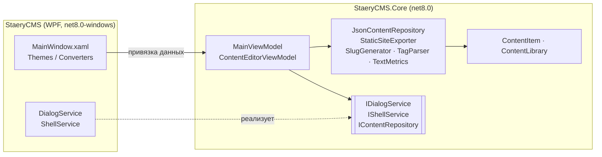

<div align="center">


# StaeryCMS

**Настольная система управления контентом: пишите в Markdown и публикуйте статический сайт.**

[](https://github.com/Staery/StaeryCMS/actions/workflows/ci.yml)


[](LICENSE)

[English](README.md) · **Русский**

</div>

---

StaeryCMS — это настольное приложение для Windows, в котором удобно вести статьи, страницы и заметки. Вы пишете в
Markdown, распределяете записи по категориям, тегам и статусам, а всё опубликованное экспортируете в готовый
статический HTML-сайт, который можно разместить где угодно.

Я сделал этот проект, чтобы отработать WPF-разработку уровня production: чистую архитектуру MVVM, тестируемую
бизнес-логику, надёжное хранение данных и собственную тему оформления.

## ✨ Возможности

| | |
|---|---|
| 📝 **Markdown-редактор** | Заголовок, краткое описание, текст, категория и теги. Количество слов и время чтения считаются на лету |
| 🔗 **Умные slug-адреса** | Адрес строится из заголовка автоматически, кириллица транслитерируется (`Мой пост` → `moy-post`), уникальность проверяется |
| 🚦 **Жизненный цикл записи** | Статусы **Черновик → Опубликовано → В архиве**. Дата первой публикации сохраняется |
| 🔍 **Поиск и фильтры** | Полнотекстовый поиск по заголовку, тексту и тегам, фильтры по статусу и категории, три варианта сортировки |
| 🌐 **Экспорт статического сайта** | Создаёт `index.html`, отдельную страницу для каждой опубликованной записи и адаптивную таблицу стилей. HTML-код из текста экранируется |
| 👁 **Предпросмотр в браузере** | Открывает текущую запись в браузере, включая ещё не сохранённые правки |
| 💾 **Надёжное хранение** | Читаемый JSON с атомарной записью. Повреждённый файл не перезаписывается, а сохраняется рядом как резервная копия |
| 🛡 **Ничего не теряется** | При переключении записи или закрытии приложения с несохранёнными правками предлагает сохранить, отменить изменения или вернуться |
| ⌨️ **Горячие клавиши** | `Ctrl+N`, `Ctrl+S`, `Ctrl+P`, `Ctrl+F`, `Ctrl+Shift+E` |

<!-- Добавьте сюда скриншот работающего приложения, например docs/screenshot.png -->

## 🧱 Технологии

| Область | Технологии |
|---|---|
| Платформа | .NET 8, C# 12 (nullable reference types, file-scoped namespaces, primary constructors) |
| Интерфейс | WPF, собственные словари ресурсов (стили, шаблоны, конвертеры), Segoe Fluent Icons |
| Архитектура | MVVM на [CommunityToolkit.Mvvm](https://learn.microsoft.com/dotnet/communitytoolkit/mvvm/) с генераторами исходного кода |
| Markdown | [Markdig](https://github.com/xoofx/markdig) с расширениями (таблицы, списки задач и т. д.) |
| Хранение | `System.Text.Json` |
| Тесты | xUnit, более 60 тестов: модульные тесты и сценарии ViewModel с использованием фейков |
| CI/CD | GitHub Actions: сборка, тесты и самодостаточный `.exe` из одного файла при каждом пуше. Версии с тегом публикуются как релизы на GitHub |

## 🏗 Архитектура

Решение разделено на два слоя. Вся логика, включая ViewModel, находится в библиотеке, которая не зависит от
интерфейса. Поэтому она полностью покрыта тестами и собирается даже на Linux и macOS. В WPF-проекте остаются только
XAML, конвертеры и тонкие платформенные сервисы.



Ключевые решения:

- **Редактор работает с копией.** `ContentEditorViewModel` редактирует рабочую копию записи, а `Commit()` переносит
  изменения в хранимую запись. Благодаря этому легко сделать отмену правок, вопрос о несохранённых изменениях и
  предпросмотр несохранённого текста.
- **Платформенные сервисы скрыты за интерфейсами.** Окна сообщений, выбор папки и открытие браузера вынесены в
  `IDialogService` и `IShellService`, поэтому тесты ViewModel запускаются без интерфейса.
- **Время внедряется через `TimeProvider`**, поэтому даты в тестах предсказуемы.
- **Атомарное сохранение.** Данные сначала записываются во временный файл и только потом заменяют основной, так что
  сбой посреди записи не обрежет библиотеку.

### Структура проекта

```
StaeryCMS/
├── src/
│   ├── StaeryCMS/                 # WPF-приложение (окна, тема, платформенные сервисы)
│   │   ├── Themes/                # Colors.xaml, Controls.xaml: дизайн-система
│   │   ├── Converters/
│   │   ├── Services/              # DialogService, ShellService
│   │   └── MainWindow.xaml
│   └── StaeryCMS.Core/            # Логика, не зависящая от интерфейса
│       ├── Models/                # ContentItem, ContentLibrary, ContentStatistics
│       ├── Services/              # Хранилище, экспорт, работа со slug, тегами и текстом
│       ├── ViewModels/            # MainViewModel, ContentEditorViewModel и др.
│       └── Abstractions/          # IDialogService, IShellService
├── tests/
│   └── StaeryCMS.Core.Tests/      # Тесты xUnit
└── .github/workflows/ci.yml
```

## 🚀 Быстрый старт

### Скачать

Скачайте последний `StaeryCMS-*-win-x64.zip` из раздела [Releases](https://github.com/Staery/StaeryCMS/releases)
или артефакт `StaeryCMS-win-x64` из последнего [запуска CI](https://github.com/Staery/StaeryCMS/actions). Это
самодостаточный `.exe`, устанавливать .NET не нужно.

### Собрать из исходников

Нужны Windows 10/11 и [.NET 8 SDK](https://dotnet.microsoft.com/download/dotnet/8.0) (или Visual Studio 2022 с
рабочей нагрузкой *.NET desktop development*).

```bash
git clone https://github.com/Staery/StaeryCMS.git
cd StaeryCMS
dotnet run --project src/StaeryCMS
```

Запустить тесты (на любой ОС):

```bash
dotnet test tests/StaeryCMS.Core.Tests
```

Собрать один исполняемый файл:

```bash
dotnet publish src/StaeryCMS -c Release -r win-x64 --self-contained -p:PublishSingleFile=true -o publish
```

## 📖 Как пользоваться

1. При первом запуске StaeryCMS создаёт несколько примеров записей, чтобы было с чем познакомиться.
2. Нажмите **New entry** (`Ctrl+N`), введите заголовок и напишите текст в Markdown.
3. Выберите статус **Published** и нажмите **Save** (`Ctrl+S`).
4. Укажите название сайта на боковой панели и нажмите **Export static site** (`Ctrl+Shift+E`). Готовую папку можно
   загрузить на GitHub Pages, Netlify или любой веб-сервер.

| Сочетание | Действие |
|---|---|
| `Ctrl+N` | Новая запись |
| `Ctrl+S` | Сохранить |
| `Ctrl+P` | Предпросмотр в браузере |
| `Ctrl+F` | Перейти к поиску |
| `Ctrl+Shift+E` | Экспорт статического сайта |

### Где хранятся данные?

Всё хранится в одном JSON-файле: `%APPDATA%\StaeryCMS\content.json`. Открыть его папку можно кнопкой
**Open data folder** на боковой панели.

```json
{
  "siteTitle": "My Staery Site",
  "items": [
    {
      "id": "0b9d4c1e-…",
      "title": "Welcome to StaeryCMS",
      "slug": "welcome-to-staerycms",
      "status": "published",
      "category": "Guides",
      "tags": ["getting-started"],
      "body": "# Welcome!\n…",
      "publishedAt": "2025-03-08T12:00:00+03:00"
    }
  ]
}
```

## 🧪 Тесты

Тесты в `tests/StaeryCMS.Core.Tests` проверяют:

- **Генерацию slug**: транслитерацию, удаление диакритики, обрезку длины, уникальность и валидацию
- **Работу с текстом**: подсчёт слов (в том числе кириллицы) и разбор тегов
- **Хранилище**: полный цикл сохранения и загрузки, читаемость JSON, устойчивость к файлам, отредактированным вручную,
  резервное копирование повреждённого файла
- **Экспорт**: в сайт попадают только опубликованные записи, порядок записей, экранирование HTML, защиту от выхода за
  пределы папки через slug
- **Сценарии MainViewModel**: фильтры и сортировку, создание, сохранение, удаление и дублирование записей, вопрос о
  несохранённых изменениях (сохранить, не сохранять, отмена), восстановление после ошибки сохранения, экспорт и
  закрытие приложения

## 🗺 Планы

- [ ] Панель живого предпросмотра Markdown (WebView2)
- [ ] Библиотека изображений с перетаскиванием
- [ ] Отложенная публикация
- [ ] RSS-лента и sitemap в экспортированном сайте
- [ ] Тёмная тема

## 📄 Лицензия

[MIT](LICENSE) © 2026 Anton Selkin
